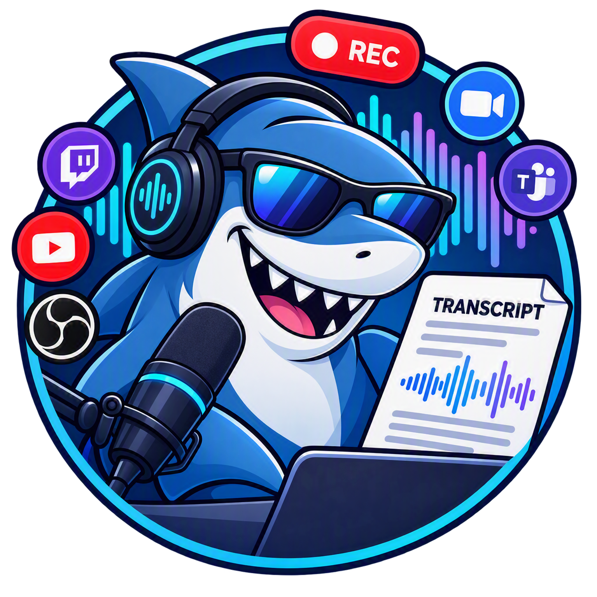
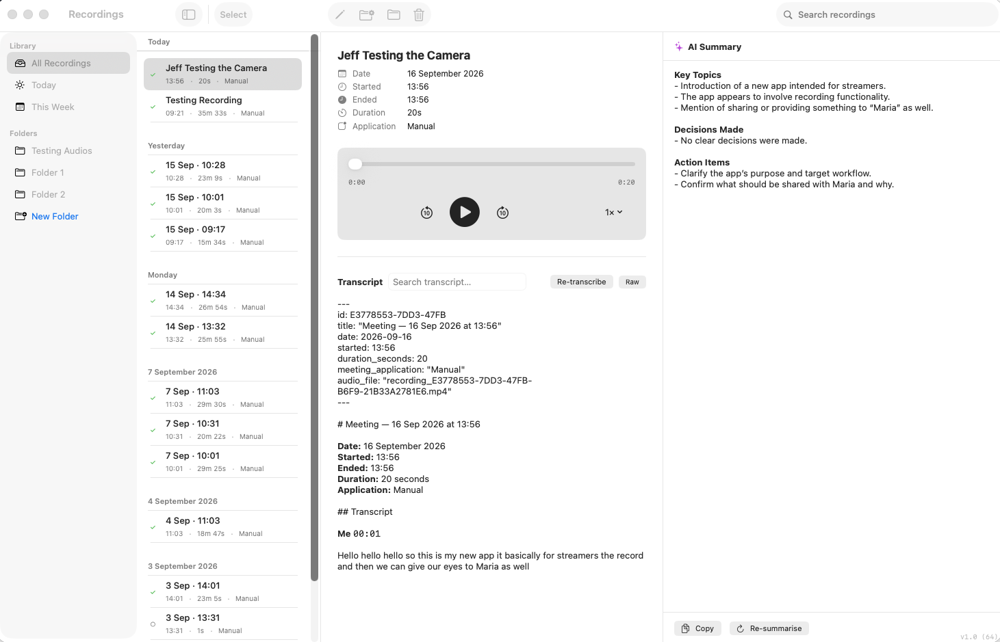
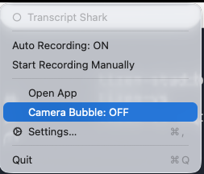
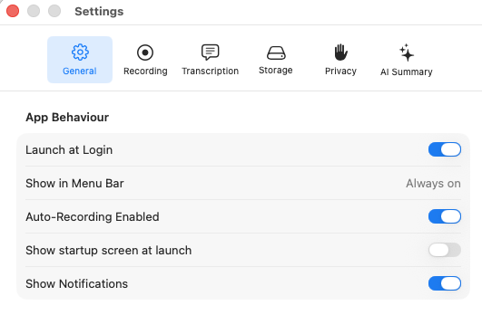

# Transcript Shark

<p align="center">
  
</p>

Transcript Shark is a native macOS menu bar app for recording, transcribing, organising, and summarising audio from calls, streams, interviews, demos, podcasts, and meetings.

It records your microphone and system audio, generates speaker-labelled transcripts, keeps everything local on your Mac, and can generate AI summaries with your choice of local CLI provider: **Tabnine** or **OpenCode**.

> **Platform:** macOS 15+ · Swift 6 · Apple Silicon & Intel

---

## Screenshots

### Main window



### Menu bar controls



### Settings



---

## What it does

- Runs quietly from the macOS menu bar.
- Records microphone audio and system audio.
- Supports manual recording for any use case.
- Can auto-detect Microsoft Teams activity and start/stop recording automatically.
- Saves recordings locally with transcripts and optional summaries.
- Organises recordings by folder, date, and search.
- Lets you rename recordings so titles are meaningful.
- Lets you record the whole screen or a selected window.
- Provides a camera bubble overlay with selectable camera input; selected-window recordings constrain the bubble to that window.
- Generates AI summaries using a local provider: Tabnine or OpenCode.
- Lets you customise the global AI prompt and override it per recording.

All data stays on your Mac. Transcript Shark does not upload audio, transcripts, or summaries to its own servers.

---

## Platform requirements

| Requirement | Value |
|---|---|
| macOS | 15.0 or later |
| Xcode | 16.0 or later to build from source |
| Swift | 6 |
| Architecture | Apple Silicon or Intel |
| AI Summary provider | Optional: Tabnine CLI or OpenCode CLI |

---

## Permissions

| Permission | Why |
|---|---|
| **Microphone** | Records your voice |
| **Screen Recording** | Captures system audio and the configured whole-screen or selected-window recording area |
| **Camera** | Shows the optional camera bubble overlay |
| **Notifications** | Notifies when recording/transcription status changes |

You are responsible for complying with recording consent laws, workplace rules, and platform policies before recording.

---

## How to use

### First launch

The onboarding flow helps you grant required permissions and acknowledge recording consent responsibilities. You can re-enable the startup screen in **Settings → General**.

### Menu bar

Transcript Shark lives in the macOS menu bar.

| Icon | State |
|---|---|
| `○` | Idle / monitoring |
| `●` | Recording |
| `◌` | Transcribing |
| `⊘` | Auto-recording disabled |
| `!` | Error |

Typical idle menu:

```text
○ Transcript Shark

Auto Recording: ON
Start Recording Manually
Camera Bubble: OFF
───────────────────────
Open App
Settings…
Quit
```

Typical recording menu:

```text
● Recording — Manual
00:23:41

Stop Recording
Open Recording
Disable Auto Recording
───────────────────────
Open App
Camera Bubble: OFF
Settings…
Quit
```

### Manual recording

Click the menu bar icon → **Start Recording Manually** to record anything: livestreams, interviews, podcasts, demos, meetings, or ad-hoc notes.

### Automatic Teams recording

When auto-recording is enabled, Transcript Shark monitors Microsoft Teams signals and starts/stops recording when a Teams call appears active. This remains an automation convenience; manual recording is available for all other workflows.

### Camera bubble

Go to **Settings → Recording** to choose whether new recordings capture the whole screen or one selected window. If the selected window is unavailable when recording starts, Transcript Shark falls back to the whole screen.

Go to **Settings → Recording → Camera Bubble** to:

- Manually show/hide the camera bubble.
- Choose **Automatic**, built-in camera, or a connected USB camera.
- Keep the bubble inside the selected window while selected-window mode is active and the window is available.

The bubble appears as a small circular preview in the bottom-right corner of the screen. Background blur was removed for stability and is not currently available.

### Main window

The main window has columns for folders, recordings, recording detail, and AI summary.

```text
┌──────────┬─────────────────┬──────────────────────────┬──────────────────┐
│ FOLDERS  │ RECORDINGS      │ RECORDING DETAIL         │ AI SUMMARY       │
│          │                 │                          │                  │
│ All      │ Sep 16          │ Product Demo             │ ✦ AI Summary     │
│ Today    │ 13:56 Demo ✓   │ 16 Sep 2026 · 22 min     │ ──────────────── │
│          │                 │                          │ Highlights...    │
│ People   │ Sep 15          │ ▶ ━━━━━━━ 12:14 / 22:00  │                  │
│  Sarah   │ 09:30 Sync ✓   │                          │ [Re-summarise]   │
└──────────┴─────────────────┴──────────────────────────┴──────────────────┘
```

### Rename recordings

You can rename recordings to something useful instead of a timestamp:

- Right-click a recording in the list → **Rename**.
- Or select a recording and click **Rename** in the detail toolbar.

Blank names are not allowed.

### Organise recordings

- Click **+ Folder** in the sidebar to create folders.
- Drag recordings into folders.
- Use **Move to Folder** from the detail toolbar.
- Folder organisation is stored as metadata; audio files are not physically moved.

### Search

Use the search bar above the recordings list to filter recordings by title.

---

## Transcripts

Each recording can produce speaker-attributed Markdown:

```markdown
---
id: 09E4FC95-17A0-4B65
title: "Product Demo"
date: 2026-09-16
started: 13:56
duration_seconds: 1320
meeting_application: "Manual"
audio_file: "recording.mp4"
---

# Product Demo

**Date:** 16 September 2026
**Started:** 13:56
**Ended:** 14:18
**Duration:** 22 minutes
**Application:** Manual

## Transcript

**Me** `00:00`

Welcome to the walkthrough.

**Them** `00:18`

Can you show the export flow?
```

If sidecar files are unavailable, Transcript Shark falls back to transcribing the combined recording.

Files are stored under:

```text
~/Library/Application Support/MeetingRecorder/Recordings/<date>_<name>/
├── recording.mp4
├── recording_mic.caf
├── recording_system.caf
├── recording_transcript.md
└── recording_summary.md
```

> The internal application-support path still uses `MeetingRecorder` for compatibility with existing local data.

---

## AI Summary

The AI Summary panel can generate and persist a Markdown summary next to the recording.

Supported local providers:

| Provider | Default executable |
|---|---|
| Tabnine | `/Users/<you>/.local/bin/tabnine` |
| OpenCode | `/usr/local/bin/opencode` |

Configure this in **Settings → AI Summary**:

- Choose **Tabnine** or **OpenCode**.
- Set the provider executable path.
- Edit the global summary instructions/prompt.
- Reset the global prompt to the default.
- Override the prompt for an individual recording from its AI Summary panel.

Example custom prompt:

```text
Give me only the highlights.
```

When you click **Summarise**, Transcript Shark sends the transcript to the selected local CLI provider. The resulting summary is saved as:

```text
<recording>_summary.md
```

Click **Re-summarise** to regenerate and overwrite the saved summary.

---

## Settings

Open via **Settings…** in the menu bar or `⌘,`.

| Tab | What you can configure |
|---|---|
| **General** | Launch at login, auto-recording, startup screen, notifications |
| **Recording** | Capture area, selected window, microphone info, camera bubble, camera selection |
| **Transcription** | Auto-transcribe after recording, language |
| **Storage** | Recording location, open in Finder, retention policy placeholder |
| **Privacy** | Screen Recording, Microphone, and Camera permission status |
| **AI Summary** | Provider selection, executable path, custom summary instructions |

---

## Building from source

### Open in Xcode

```bash
open MeetingRecorder/MeetingRecorder.xcodeproj
```

Then select the **MeetingRecorder** scheme, choose **My Mac**, and press `⌘R`.

### CLI build

```bash
cd MeetingRecorder
xcodebuild build \
  -project MeetingRecorder.xcodeproj \
  -scheme MeetingRecorder \
  -destination 'platform=macOS'
```

If code signing fails during local development, compile with signing disabled:

```bash
xcodebuild build \
  -project MeetingRecorder.xcodeproj \
  -scheme MeetingRecorder \
  -destination 'platform=macOS' \
  CODE_SIGNING_ALLOWED=NO
```

### Run tests / validation build

```bash
xcodebuild build \
  -project MeetingRecorder.xcodeproj \
  -target MeetingRecorderTests \
  -configuration Debug \
  CODE_SIGNING_ALLOWED=NO
```

---

## Building a DMG

```bash
cd MeetingRecorder

xcodebuild archive \
  -project MeetingRecorder.xcodeproj \
  -scheme MeetingRecorder \
  -configuration Release \
  -archivePath build/TranscriptShark.xcarchive

rm -rf build/dmg-root
mkdir -p build/dmg-root
cp -R "build/TranscriptShark.xcarchive/Products/Applications/Transcript Shark.app" build/dmg-root/
ln -s /Applications build/dmg-root/Applications

hdiutil create \
  -volname "Transcript Shark" \
  -srcfolder build/dmg-root \
  -ov \
  -format UDZO \
  build/Transcript-Shark.dmg
```

For public distribution, sign with a paid Apple Developer ID and notarize the DMG.

---

## Dependencies

No third-party app libraries are bundled. Transcript Shark uses Apple frameworks and optional local CLI tools.

| Framework / Tool | Purpose |
|---|---|
| SwiftUI / AppKit | Native macOS UI and menu bar |
| SwiftData | Persistence |
| ScreenCaptureKit | System audio capture |
| AVFoundation | Microphone, camera preview, audio files |
| Speech | Transcription |
| UserNotifications | Notifications |
| ServiceManagement | Launch at login |
| Foundation.Process | Local AI CLI invocation |
| Tabnine CLI | Optional AI Summary provider |
| OpenCode CLI | Optional AI Summary provider |

---

## Privacy

- Audio, transcripts, and summaries are stored locally.
- Transcript Shark does not run analytics or telemetry.
- Transcript Shark does not upload recordings to its own servers.
- AI Summary uses the local provider you choose. Review that provider’s own configuration and network behaviour.
- Secrets and API keys should not be stored in this repository.

---

## Roadmap

Shipped/current:

- Manual recording
- Teams auto-detection
- Speaker-attributed transcription
- Folder organisation
- Recording rename
- Camera bubble with camera selection
- AI Summary with Tabnine/OpenCode provider selection
- Global and per-recording custom summary prompts
- Menu bar controls

Possible future work:

- Zoom, Google Meet, and Slack Huddle detection
- Local Whisper transcription option
- Full-text search across transcripts
- More robust AI extraction views
- Signed/notarized public DMG release

---

## License

See [LICENSE](LICENSE).
